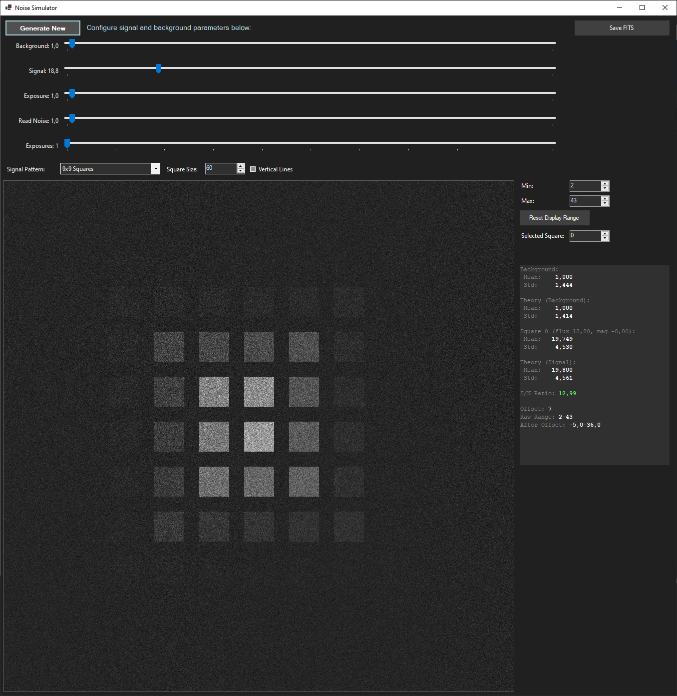

# Camera Noise Simulator

A C# application that simulates photon detection with various noise sources and signal patterns, designed for astronomical data simulation. It is fully functional and quite useful though mostly written through vibe-coding.



Everything below this line is writtent by AI-agent for keeping context.

## Project Concept

The Noise Simulator simulates real-world astronomical detectors by modeling:
- **Photon Detection**: Poisson distribution for photon arrivals
- **Read Noise**: Gaussian noise from detector electronics
- **Signal Patterns**: Various astronomical objects and test patterns
- **Quantization**: Conversion to integer ADU (Analog-to-Digital Unit) values
- **FITS Export**: Standard astronomical data format for professional analysis

## Key Technical Decisions

### 1. Photon Detection Physics
**Decision**: Model real detector behavior with proper statistical distributions
- **Poisson Distribution**: Correctly models photon arrivals as independent events
- **Read Noise**: Gaussian noise added to simulate detector electronics
- **Quantization**: Integer output to simulate real ADU values
- **Offset**: Prevents negative values and simulates detector bias

### 2. Signal Pattern Generation
**Decision**: Separate signal generation from noise simulation
- **SignalGenerator Class**: Encapsulates all pattern generation logic
- **Modular Design**: Easy to add new patterns (Gaussian Spots, etc.)
- **Configurable Patterns**: Square size, vertical lines, multiple brightness levels
- **Astronomical Objects**: Gaussian spots for realistic star simulation

### 3. Statistics Calculation
**Decision**: Accurate theoretical vs. observed statistics comparison
- **StatisticsCalculator Class**: Dedicated statistics processing
- **Background vs. Signal**: Separate analysis for different regions
- **Signal-to-Noise Ratio**: Professional astronomical metric
- **Theoretical Validation**: Ensures simulation accuracy

### 4. FITS Format Implementation
**Decision**: Follow strict FITS standard for professional compatibility

#### Critical FITS Requirements:
- **Header Format**: 80-character records, 2880-byte blocks
- **Data Types**: Proper keyword formatting (logical, integer, float, string)
- **Encoding**: Pure ASCII, no BOM, no null bytes
- **Byte Order**: Big-endian for 16-bit signed integers
- **Padding**: Complete 2880-byte blocks for header and data

#### Key Implementation Details:
```csharp
// Proper FITS keyword formatting
WriteFitsLogical(writer, "SIMPLE", true, "FITS standard");
WriteFitsInteger(writer, "BITPIX", 16, "Number of bits per data pixel");
WriteFitsFloat(writer, "BZERO", 32768.0, "Physical value corresponding to zero");

// Big-endian data writing
byte[] bytes = BitConverter.GetBytes(signedValue);
if (BitConverter.IsLittleEndian)
{
    writer.Write(bytes[1]); // High byte first
    writer.Write(bytes[0]); // Low byte second
}
```

### 5. UI/UX Design Decisions
**Decision**: Professional interface for scientific use
- **Dark Theme**: Better for astronomical data viewing
- **Real-time Statistics**: Immediate feedback on simulation quality
- **Configurable Parameters**: Full control over simulation parameters
- **Professional Export**: FITS format for standard astronomical software

## Architecture

### Core Classes
- **PhotonDetector**: Simulates photon detection with Poisson + Gaussian noise
- **SignalGenerator**: Generates various signal patterns (squares, Gaussian spots)
- **StatisticsCalculator**: Calculates background and signal statistics
- **FitsWriter**: Exports data in standard FITS format
- **MainForm**: GUI coordination and user interaction

### Data Flow
1. **Signal Generation**: Create pattern with specified flux levels
2. **Photon Detection**: Apply Poisson distribution + read noise
3. **Quantization**: Convert to integer ADU values
4. **Statistics**: Calculate background vs. signal statistics
5. **Display**: Normalize for visualization
6. **Export**: Save as FITS with proper scaling

## FITS Export Success Factors

### 1. Header Compliance
- **SIMPLE = T**: Indicates FITS standard
- **BITPIX = 16**: 16-bit signed integers
- **NAXIS = 2**: 2D image data
- **BZERO/BSCALE**: Proper physical value scaling

### 2. Data Format
- **16-bit Signed**: FITS standard for astronomical data
- **Big-endian**: Network byte order
- **Proper Scaling**: BZERO=32768, BSCALE=1.0 for standard offset

### 3. File Structure
- **2880-byte Header**: Complete FITS header block
- **2880-byte Data Blocks**: Properly padded data
- **ASCII Encoding**: No BOM, no null bytes

### 4. Viewer Compatibility
- **NASA FITS Verifier**: Passes with 0 errors
- **GIMP**: Perfect display
- **ASTAP**: Professional astronomical software
- **AsiFitsViewer**: Specialized FITS viewer

## Usage

### Basic Simulation
1. Set background flux (photons/second)
2. Set signal flux (photons/second)
3. Choose signal pattern (squares, Gaussian spots)
4. Adjust read noise level
5. Click "Generate New" to create simulation
6. View statistics and image

### FITS Export
1. Generate simulation data
2. Click "Save FITS" button
3. Choose filename and location
4. File is saved in standard FITS format
5. Open in any astronomical software

### Advanced Features
- **Multiple Exposures**: Average multiple frames
- **Square Size Control**: Adjust pattern dimensions
- **Vertical Lines**: Alternative to solid squares
- **Gaussian Spots**: Realistic astronomical objects
- **Statistics Analysis**: Background vs. signal comparison

## Technical Specifications

### Supported Formats
- **Input**: Real-time parameter adjustment
- **Output**: FITS (Flexible Image Transport System)
- **Display**: 1024x1024 pixel visualization
- **Data**: 16-bit signed integers

### Performance
- **Real-time Generation**: Instant simulation updates
- **Memory Efficient**: Optimized for large datasets
- **Professional Export**: Standard-compliant FITS files

### Compatibility
- **Operating System**: Windows (Windows Forms)
- **FITS Viewers**: All standard astronomical software
- **Data Analysis**: Compatible with professional tools

## Mathematical Foundation

### Photon Detection Model
```
Detected_Photons = Poisson(λ) + Gaussian(0, σ_read) + Offset
```
Where:
- λ = (background_flux + signal_flux) × exposure_time
- σ_read = read_noise_level
- Offset = 3 × read_noise (prevents negative values)

### FITS Data Scaling
```
Physical_Value = BZERO + BSCALE × FITS_Value
```
Where:
- FITS_Value = signed 16-bit integer (-32768 to +32767)
- BZERO = 32768.0 (standard offset)
- BSCALE = 1.0 (no additional scaling)

## Success Metrics

✅ **NASA FITS File Verifier**: 0 errors, 0 warnings  
✅ **Professional Software**: Works with ASTAP, ASIFitsView
✅ **Standard Compliance**: Full FITS standard adherence  
✅ **Mathematical Accuracy**: Correct Poisson + Gaussian statistics  
✅ **User Experience**: Intuitive interface for scientific use  

## Files

- `MainForm.cs`: GUI implementation and user interaction
- `PhotonDetector.cs`: Core photon detection simulation
- `SignalGenerator.cs`: Signal pattern generation
- `StatisticsCalculator.cs`: Statistical analysis
- `FitsWriter.cs`: FITS format export
- `Program.cs`: Application entry point
- `NoiseSimulator.csproj`: Project configuration

## Building and Running

```bash
# Build the project
dotnet build

# Run the application
dotnet run
```

The Noise Simulator represents a complete solution for astronomical data simulation, combining accurate physics modeling with professional data export capabilities. 